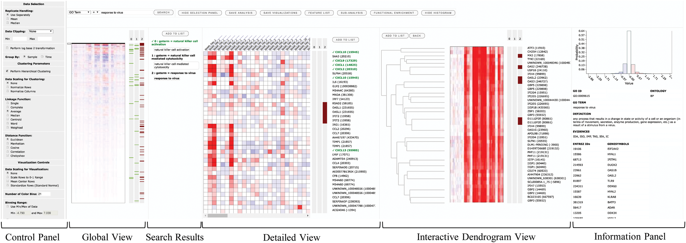

# Systems-Level Interactive Data Exploration (SLIDE)  
## User-driven Visualization of Large-scale -omics Data on a Web-browser  

**SLIDE** is available at: http://137.132.97.109/VTBox/ 

**SLIDE** is a tool for customized visualization and interactive exploration of high throughput quantitative -omics data. SLIDE can organize and visualize quantitative -omics data in expression based heatmaps on a standard web browser. It allows users to interactively navigate through the heatmaps 
and create sub-analyses of selected feature sets. It can be used to visualize the data at different levels of granularity through multiple simultaneous views.  

If you use this tool, please cite the following work:  

Soumita Ghosh, Abhik Datta, Kaisen Tan, Hyungwon Choi; __SLIDE – a web-based tool for interactive visualization of large-scale – omics data__, *Bioinformatics*, , bty534, https://doi.org/10.1093/bioinformatics/bty534  

## Resources

* [Online Version](http://137.132.97.109/VTBox/) 
* [User Manual](https://github.com/soumitag/SLIDE/raw/master/application/slide/SLIDE_Users_Manual.pdf)
* [Stand-alone Version](https://github.com/soumitag/SLIDE/raw/master/application/slide.zip) (for installation on user's computer) 
* [Windows Installation Guide](https://github.com/soumitag/SLIDE/raw/master/application/slide/SLIDE_Windows_Installation_Guide.pdf)  
* [macOS Installation Guide](https://github.com/soumitag/SLIDE/raw/master/application/slide/SLIDE_macOS_Installation_Guide.pdf)

## Setup

**SLIDE** is available both as an [online version](http://137.132.97.109/VTBox/) as well as a stand-alone version (for installation on user's computer).  

### Prerequisites (for local installation)  

Before you can configure **SLIDE** to run in your local environment, please install the following softwares:  

* Java Development Kit (JDK)
* GlassFish Server
* MongoDB  
* Python
* Numpy (Python Package) 
* Scipy (Python Package)
* fastcluster (Python Package)  

Please refer to the installation guide ([Windows](https://github.com/soumitag/SLIDE/raw/master/application/slide/SLIDE_Windows_Installation_Guide.pdf) / [macOS](https://github.com/soumitag/SLIDE/raw/master/application/slide/SLIDE_macOS_Installation_Guide.pdf)) for more details.

## Inputs to **SLIDE**

### Input Data

**SLIDE** takes an input data file containing the matrix of expression values in a text delimited format
(comma, tab, space, semi-colon, pipe). The data file should not contain single or double quotes. For
querying and tagging of features (genes), the input data file must have at least one column containing
the following identifiers (referred to as meta data column in **SLIDE**): Entrez ID, official gene
symbols, Ensemble IDs (gene or transcript), RefSeq Accession ID or Uniprot ID. It is still possible to
visualize the data without any standard identifiers, although search and tagging of genes will not be
available in this case.

Sample input data files can be found [here](https://github.com/soumitag/SLIDE/tree/master/data).

### Sample Information File  

Sample information file should be prepared in a text file with a specific delimiter (comma, tab,
space, semi-colon, pipe), where each line contains the meta data for a sample, whose quantitative
molecular data is in a column in the input data. The file is used to infer replicate and sample group
information, which determines column ordering during visualization.  

If sample grouping or replicate information is not available, no sample information file is required in that case.

Example sample information files can be found [here](https://github.com/soumitag/SLIDE/tree/master/data).

Please refer to the [User Manual](https://github.com/soumitag/SLIDE/raw/master/application/slide/SLIDE_Users_Manual.pdf) for more details on the input data file and sample information file formats. 

## Organization of **SLIDE** Repository

**SLIDE** repository is organized into three folders.  

* **application**	The entire content in this folder needs to be downloaded to configure **SLIDE** locally on your computer
* **data** 		This folder contains example input datasets and sample information files
* **source**		This folder contains the source code for **SLIDE**

## License  

Systems-Level Interactive Data Exploration **(SLIDE)** is a user-driven interactive visualization tool for large-scale –omics data. This document describes the step-by-step guideline for using SLIDE’s functionalities. SLIDE is distributed under the BSD license. See the LICENSE.txt in the source
distribution or [here](https://opensource.org/licenses/BSD-2-Clause).  

